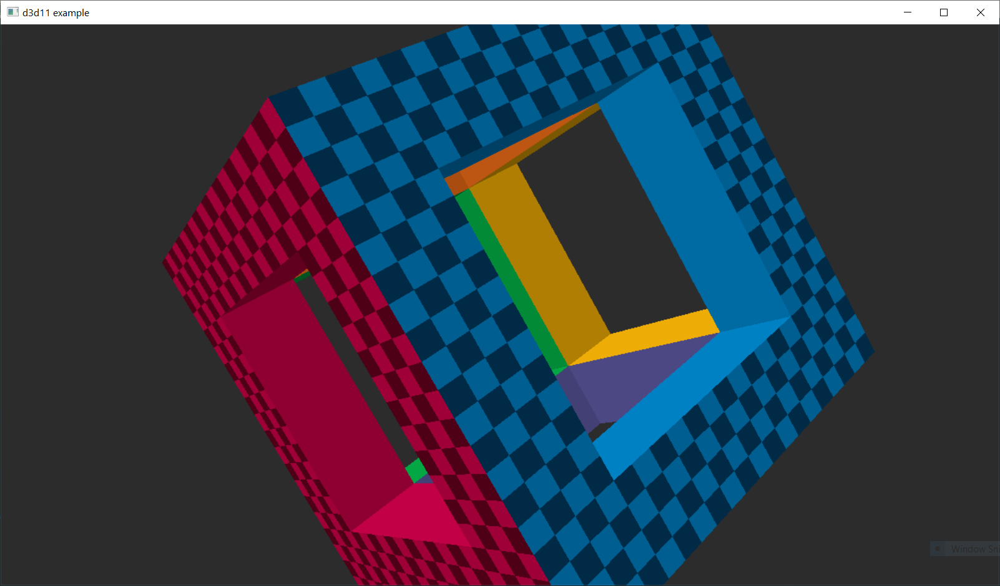

# Direct3D 11 minimal Jai example

From [this gist originally by d7samurai](https://gist.github.com/ashelley/6520e2ad63cb366c0155353cb8ed7b6d)

To compile and run:

```
jai -x64 d3d11_example.jai && d3d11_example.exe
```


